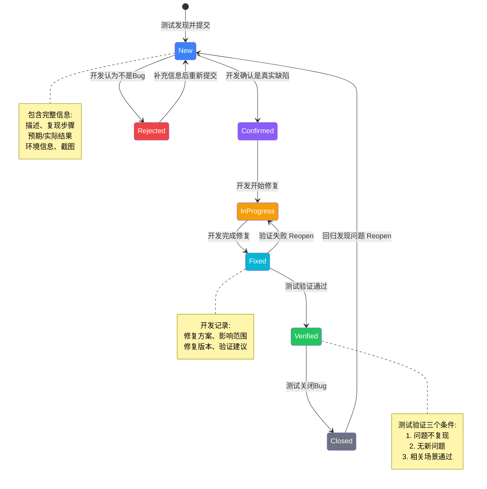

## 基础入门

Bug 生命周期（Bug Lifecycle）描述缺陷从发现到关闭的完整流转过程。典型状态包括：

新建（测试发现）。

确认（开发确认）。

修复中（开发处理）。

待验证（修复完成）。

验证通过（测试确认修复）。

关闭（问题解决）。

Bug 生命周期可能还有拒绝（非缺陷）、延迟处理（优先级低）、reopened（验证失败重新打开）等状态。规范的 Bug 生命周期确保缺陷可追踪、不遗漏、责任清晰。

Bug 生命周期的价值体现在三方面：

一是缺陷可追踪，每个 Bug 从发现到关闭有完整记录。

二是责任清晰，每个状态有明确的责任人（测试新建和验证、开发确认和修复）。

三是质量度量，通过 Bug 数据统计分析质量趋势。面试时能讲清各状态含义和流转条件，才算有规范的缺陷管理经验。

## 为什么重要

- 面试必考基础：「Bug 状态怎么流转」「什么情况下 Bug 会 reopen」是测试岗位面试的基础问题。
- 缺陷管理规范：规范的 Bug 流程确保问题不遗漏、责任清晰、可追溯。
- 质量度量基础：Bug 统计数据（数量、分布、趋势）是评估项目质量的重要依据。
- 协同效率保障：明确的流转规则让测试和开发协同高效，避免推诿和沟通成本。
- 根因分析依据： reopen 的 Bug、拒绝的 Bug 等数据能帮助团队分析根因、改进流程。

## 前置知识

- 测试基础：理解什么是 Bug、Bug 报告的基本要素（描述、复现步骤、预期结果、实际结果）。
- 研发流程基础：了解软件开发的基本流程（开发、测试、发布），知道 Bug 在流程中的位置。
- 工具使用基础：能使用 Bug 管理工具（如 Jira、禅道、TAPD）提交和跟踪 Bug。
- 沟通协作基础：理解测试和开发的协作模式，知道 Bug 流转涉及的角色和职责。

## 学习路径

- 第一阶段：理解概念。学习 Bug 生命周期的定义、各状态含义、流转规则。
- 第二阶段：工具使用。学习使用 Bug 管理工具提交 Bug、跟踪状态、关闭 Bug。
- 第三阶段：规范实践。学习编写规范的 Bug 报告（清晰描述、完整复现步骤、必要截图日志）。
- 第四阶段：流转管理。学习 Bug 状态流转的规则、reopen 的处理、拒绝 Bug 的应对。
- 第五阶段：质量分析。学习 Bug 数据统计分析（数量、分布、趋势、 reopen 率），用数据驱动质量改进。
- 第六阶段：流程优化。学习优化 Bug 流程（如自动化流转规则、与 CI 集成、根因分析机制）。

## 实操案例：Bug 流转完整流程

场景：测试发现下单接口在库存为 0 时仍能下单成功，需要提交 Bug 并跟踪修复。

解决方案：完整 Bug 流转流程

第一步：新建 Bug（测试人员）
操作：在 Jira 创建 Bug，填写完整信息
内容：

- 标题：库存为 0 时仍能下单成功
- 描述：用户在商品库存为 0 的情况下，仍能提交订单成功
- 复现步骤：

1. 创建测试商品，库存设为 0。

2. 用户下单。

3. 订单创建成功

- 预期结果：下单失败，提示库存不足
- 实际结果：下单成功，订单创建
- 环境：测试环境 v1.2.0
- 优先级：P0（阻塞性问题）
- 附件：请求和响应日志截图
  状态流转：新建 → 等待开发确认

第二步：确认 Bug（开发人员）
操作：开发查看 Bug，复现问题，确认是真实缺陷
内容：开发在本地环境复现问题，确认是库存校验逻辑缺失
状态流转：确认 → 修复中

第三步：修复 Bug（开发人员）
操作：开发修复代码，提交修复说明
内容：在下单接口增加库存校验逻辑，库存为 0 时返回错误提示
修复说明：修改 order-service 的库存校验代码，增加库存检查
状态流转：修复中 → 待验证

第四步：验证 Bug（测试人员）
操作：测试在测试环境验证修复
内容：按复现步骤执行，验证库存为 0 时下单是否失败
结果：下单失败，提示「库存不足」，修复有效
状态流转：验证通过 → 等待关闭

第五步：关闭 Bug（测试人员）
操作：测试关闭 Bug，记录验证结论
内容：验证通过，库存校验功能正常
状态流转：关闭
备注：相关场景（库存为 1、库存不足部分购买）也已验证通过

面试表达要点：强调每个状态有明确的责任人和流转条件，测试负责新建和验证，开发负责确认和修复，测试负责关闭。

## 实操案例：Bug reopen 处理

场景：Bug 修复验证通过后关闭，但后续版本回归测试发现相同问题又出现。

问题分析：修复代码被其他代码覆盖，导致问题复现

处理流程：

1. reopen Bug：将 Bug 状态从「关闭」改为「新建」

2. 记录回归发现原因：版本号、回归场景、复现步骤

3. 开发重新处理：分析根因（修复代码被覆盖），重新修复

4. 测试再次验证：验证修复有效，同时检查相关场景

5. 关闭 Bug：记录验证结论，备注 reopen 原因

根因分析：开发修复时只修改了测试环境的配置，代码修复没有合入主分支，后续发版时测试环境代码被主分支覆盖，导致问题复现。

改进措施：修复必须合入主分支，不能只改环境配置。reopen 的 Bug 要团队周会通报，避免类似问题。

面试表达要点：强调 reopen 的 Bug 要特别重视，需要追溯根因并记录教训，避免类似问题再次发生。

## 常见误区

### 误区一：Bug 状态流转不规范

如果 Bug 状态随意跳转（如新建直接关闭），会导致问题遗漏或责任不清。

正确做法是：严格按照流程流转，每个状态变更要有明确原因记录。\n\n比如新建→确认→修复中→待验证→验证通过→关闭，不能跳过中间状态。面试时要说明你们团队的 Bug 流程规范。

### 误区二：验证通过后 Bug 还不关闭

验证通过后应该及时关闭 Bug，否则 Bug 系统会积累大量已解决问题。

正确做法是：关闭 Bug 是测试的责任，关闭时要记录验证方法和结论。\n\n比如「验证通过，库存校验功能正常，相关场景已验证」。

### 误区三：reopen 的 Bug 不追溯根因

如果 Bug reopen 后只是再次修复，可能掩盖更深层问题。

正确做法是：reopen 的 Bug 要追溯根因（修复不彻底、理解偏差、回归问题），并记录教训。\n\n比如「修复代码没有合入主分支，导致发版后问题复现」，改进措施是「修复必须合入主分支」。

### 误区四：Bug 报告信息不完整

Bug 报告缺少复现步骤、环境信息、截图日志，会导致开发无法复现和定位。

正确做法是：Bug 报告要包含完整信息（标题、描述、复现步骤、预期结果、实际结果、环境、优先级、附件）。

### 误区五：Bug 优先级设置不合理

所有 Bug 都设为高优先级会导致开发无法判断处理顺序。

正确做法是：按影响范围设置优先级（P0 阻塞性、P1 严重、P2 一般、P3 轻微），P0 和 P1 优先处理，P3 可以延后处理。

## 面试问答

### Bug 从发现到关闭怎么流转？

Bug 从发现到关闭的标准流转过程有六个状态：

第一个状态是新建（New），测试人员发现问题后提交 Bug，Bug 状态为新建，等待开发确认。新建状态要包含 Bug 描述、复现步骤、期望结果、实际结果、环境信息、截图或日志。

第二个状态是确认（Confirmed），开发人员确认 Bug 是真实问题，Bug 状态变为确认，等待开发处理。如果开发认为不是 Bug（如需求理解不一致、复现不了），会拒绝（Rejected）并说明原因。

第三个状态是修复中（In Progress），开发人员开始修复 Bug，Bug 状态变为修复中，等待修复完成。开发修复时要记录修复方案和影响范围。

第四个状态是待验证（Fixed/Resolved），开发人员完成修复，Bug 状态变为待验证，等待测试验证。开发要说明修复内容、修复版本、建议验证方法。

第五个状态是验证通过（Verified），测试人员验证修复有效，Bug 状态变为验证通过，等待关闭。验证时要确认问题不再复现、修复没有引入新问题、相关场景也验证通过。

第六个状态是关闭（Closed），Bug 问题解决，状态变为关闭，Bug 生命周期结束。关闭时要记录验证方法和结论。

面试时要说明：每个状态有明确的流转条件和责任人，测试负责新建和验证，开发负责确认和修复，测试负责关闭。状态不能随意跳转，每个变更要有原因记录。

### 什么情况下 Bug 会 reopen？

Bug reopen（重新打开）有三种典型情况：

第一种情况是修复验证失败。开发声称已修复，但测试验证后发现问题仍然存在。处理方式：Bug 状态从「待验证」reopen 到「修复中」，测试记录验证失败原因（问题仍复现、只部分修复、修复引入新问题），开发重新修复。

第二种情况是回归发现问题。修复验证通过后 Bug 已关闭，但后续版本回归测试发现相同问题又出现。处理方式：Bug 状态从「关闭」reopen 到「新建」，测试记录回归发现原因（版本号、回归场景），开发重新处理。回归失败的原因分析：修复代码被其他代码覆盖、修复只生效于特定版本、相关功能变更导致问题又出现。

第三种情况是关联问题发现。Bug 关闭后发现相关问题需要一起处理。处理方式：可以 reopen 原 Bug 并补充关联问题描述，或新建关联 Bug 并关联原 Bug。

面试时要强调：reopen 的 Bug 要特别重视，因为说明之前的修复有问题。reopen 后要追溯根因，并记录教训避免类似问题。

### 你怎么判断 Bug 可以关闭？

判断 Bug 可以关闭有三个条件，三个条件必须同时满足：

第一个条件是问题验证不再复现。按照 Bug 报告中的复现步骤，在修复版本上多次执行，确认问题不再出现。验证不只是按原步骤执行一次，要覆盖多种场景：原复现步骤、边界场景、关联场景、压力场景（多次执行）。如果原步骤不复现但边界场景仍有问题，不能关闭 Bug。

第二个条件是修复没有引入新问题。验证修复后相关功能仍然正常，没有引入新的缺陷。检查方法：跑相关模块的回归测试、检查相关功能的正常场景、检查修复代码的影响范围。如果修复引入新问题（如其他功能异常、性能下降），不能关闭 Bug，要先修复新问题。

第三个条件是相关影响场景验证通过。Bug 可能影响多个场景，不只是报告中的复现场景。

验证方法：根据 Bug 影响范围分析，验证所有可能受影响的场景。\n\n比如一个支付 Bug，不只是验证支付成功场景，还要验证支付失败、支付取消、支付超时等场景。所有相关场景验证通过后才能关闭 Bug。

面试时要说明：Bug 关闭不是「跑一次不复现就关闭」，而是「不复现 + 无新问题 + 相关场景通过」三个条件都满足。
