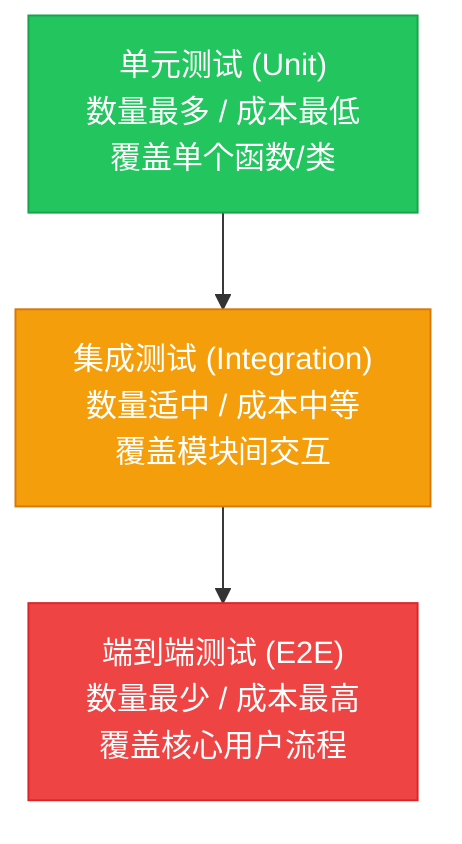

## 基础入门

测试金字塔（Test Pyramid）是测试分层策略的经典模型，由敏捷开发先驱 Mike Cohn 在 2009 年提出。它的核心思想是：测试数量应从底层单元测试向上递减，形成金字塔结构以平衡成本与覆盖。金字塔分为三层：底层是单元测试（Unit Testing），数量最多，测试单个函数或类的逻辑，成本低、执行快、定位准。中间层是集成测试（Integration Testing），测试模块间的交互，数量适中，成本中等。顶层是端到端测试（E2E Testing），测试完整用户流程，数量最少，成本高、执行慢、维护难。测试金字塔的价值在于指导团队合理分配测试资源，避免「倒金字塔」（大量 UI 测试、少量单元测试）导致的高成本低效率问题。面试时能讲清金字塔各层的定位、成本和比例，体现你对测试体系的系统性理解。

## 为什么重要

- 测试策略的基石：金字塔是测试分层的指导框架，帮助团队合理分配测试资源，避免资源浪费在低效测试上。
- 成本控制的关键：底层单元测试成本低、反馈快，大量覆盖代码路径。顶层 UI 测试成本高、维护难，只覆盖核心流程。

整体测试成本可控。

- 面试必考内容：「你们项目的测试金字塔是什么样的」是测试开发面试的经典问题，能讲清各层比例和划分原则才算有实战经验。
- 质量保障的体系：金字塔结构确保测试覆盖全面，底层保逻辑正确性，中间保模块交互，顶层保用户流程，三层配合保障整体质量。
- 技术债的预警：倒金字塔（UI 测试过多）是技术债的信号，金字塔角度能帮助识别和整改测试结构问题。

## 相关术语对比

### 测试金字塔与测试奖杯有什么区别？

测试金字塔主张单元测试最多、集成测试适中、端到端测试最少。测试奖杯（Test Trophy）更强调集成测试的重要性，认为集成测试比单元测试更能验证真实业务场景，主张集成测试占比最大。金字塔适合传统分层架构，奖杯适合微服务架构（服务间交互多）。

### 测试金字塔与测试菱形有什么区别？

测试菱形主张集成测试占比最大，单元和端到端测试占比较少，与金字塔重心相反。菱形适合业务逻辑主要在服務層的场景，金字塔适合业务逻辑分散在各层的场景。选择哪种模型取决于项目架构和业务特点。

### 单元测试和集成测试的边界怎么划分？

边界看「依赖范围」和「测试目的」：

单元测试只测试单个函数或类，外部依赖用 Mock 替代，目的是验证逻辑正确性。

集成测试测试多模块协作，外部依赖用真实环境，目的是验证模块交互正确性。

核心区别是「是否涉及真实外部依赖」。

## 实操案例

- 电商项目金字塔：

单元测试占 60%（约 800 个用例），覆盖订单计算、支付逻辑、促销规则等核心模块。

集成测试占 30%（约 400 个用例），覆盖订单-支付交互、库存-订单交互、消息队列投递。

端到端测试占 10%（约 130 个用例），覆盖登录→浏览→下单→支付核心流程。

- 金融项目金字塔：

单元测试占 70%（约 1200 个用例），覆盖金额计算、风控规则、对账逻辑等高风险模块。

集成测试占 25%（约 400 个用例），覆盖银行接口交互、核心账务系统交互。

端到端测试占 5%（约 70 个用例），覆盖开户→充值→交易→提现核心流程。

- 从倒金字塔调整：原项目 80% 是 UI 测试、10% 接口测试、10% 单元测试，回归成本高、失败定位难。调整策略：

第一步补齐单元测试，优先覆盖核心模块（订单、支付、用户）。

第二步精简 UI 测试，只保留核心业务流程。

第三步加强集成测试，覆盖模块间交互。

调整后比例：50% 单元、30% 接口、20% UI，回归时间从 4 小时缩短到 1 小时。

## 常见误区

### 误区 1：只知道金字塔形状，不讲实际落地比例

正确做法：按团队能力和业务阶段设定具体比例，如初期 50% 单测、30% 接口、20% UI，后续逐步优化。面试时要结合项目讲具体数字和调整思路，不能只画金字塔图。

### 误区 2：忽略金字塔各层的测试重点

正确做法：明确各层测试目标——单元测试关注逻辑正确性（单个函数、类的逻辑），集成测试关注模块交互（数据库、API、消息队列），端到端测试关注用户流程（登录→下单→支付完整链路）。面试时要讲清各层的测试目标和设计原则。

### 误区 3：一刀切要求全部高覆盖

正确做法：按风险分级设定覆盖目标——核心模块高覆盖（80%+ 单元），次要模块适度覆盖（50%+ 单元），边缘功能不强制。面试时要说明覆盖率目标要可落地，关键路径全覆盖比全部路径高覆盖更有价值。

## 面试问答

### 你们项目的测试金字塔是什么样的？

我们项目的测试金字塔是「底层单元测试占比最大、中间集成测试适中、顶层端到端测试最少」的结构。具体比例是：单元测试占 60%（约 800 个用例），集成测试占 30%（约 400 个用例），端到端测试占 10%（约 130 个用例）。单元测试覆盖核心业务模块（订单计算、支付逻辑、促销规则），集成测试覆盖模块间交互（订单 - 支付、库存 - 订单、消息队列投递），端到端测试覆盖核心用户流程（登录→浏览→下单→支付）。这个比例的设定逻辑是：单元测试成本低、反馈快，可以大量覆盖代码路径。集成测试成本中等，覆盖模块协作。端到端测试成本高、维护难，只覆盖核心流程。

### 怎么从倒金字塔逐步调整？

从倒金字塔调整到正金字塔分三步走：

第一步，评估现状和设定目标。分析当前测试分布（如 80% UI、10% 接口、10% 单元），设定调整目标（如 50% 单元、30% 接口、20% UI）。

第二步，从底层补齐单元测试。优先对核心业务模块补齐单元测试（订单计算、支付逻辑、促销规则），每个模块先覆盖关键路径，再逐步扩展覆盖率。

第三步，逐步减少 UI 测试范围。UI 测试只保留核心业务流程（下单、支付），其他功能验证下移到接口测试或单元测试。调整不是一次性完成，而是分阶段逐步调整，保证整体覆盖率不下降。

### 单元测试和集成测试的边界怎么划分？

边界划分看「依赖范围」和「测试目的」：

单元测试的边界是「单模块内」，不涉及外部依赖，外部依赖（数据库、网络、第三方服务）用 Mock 或 Stub 替代，目的是验证逻辑正确性（如订单金额计算函数是否正确）。

集成测试的边界是「多模块协作」，涉及真实外部依赖，外部依赖用真实环境（真实数据库、真实消息队列），目的是验证模块交互正确性（如订单模块和数据库的交互是否正确）。

具体判断方法：如果测试需要启动数据库、连接网络、调用外部服务，就是集成测试。\n\n如果测试只需要内存中的数据和 Mock 对象，就是单元测试。
