## 按天安排

```mermaid
graph LR
    subgraph Day1["第 1 天: 基础夯实"]
        A1["术语体系<br/>测试金字塔/Bug生命周期<br/>性能测试术语"]
        A2["接口测试<br/>API测试方法<br/>Postman/Requests"]
        A3["Pytest框架<br/>Fixture/Parametrize<br/>插件生态"]
        A4["幂等性<br/>概念理解<br/>面试答题骨架"]
    end

    subgraph Day2["第 2 天: 项目实战"]
        B1["支付/电商项目<br/>项目故事准备<br/>2个项目案例"]
        B2["支付回调场景<br/>回调流程<br/>异常处理"]
        B3["登录鉴权场景<br/>Token机制<br/>权限验证"]
    end

    subgraph Day3["第 3 天: 面试表达"]
        C1["编码题模板<br/>重试机制<br/>数据构造"]
        C2["自我介绍<br/>1分钟/3分钟版本<br/>亮点突出"]
        C3["项目描述<br/>STAR法则<br/>量化成果"]
        C4["AI时代成长<br/>AI工具使用<br/>能力提升"]
    end

    Day1 --> Day2
    Day2 --> Day3

    style Day1 fill:#3b82f6,color:#fff
    style Day2 fill:#22c55e,color:#fff
    style Day3 fill:#f59e0b,color:#fff
```

- 第 1 天：术语体系 + 接口测试 + Pytest + 幂等。
- 第 2 天：支付/电商项目 + 支付回调 + 登录鉴权场景题。
- 第 3 天：编码题模板 + 自我介绍 + 项目描述 + AI 时代成长表达。

## 使用建议

- 每个主题先看摘要和高频问题，再补细节。
- 把答题骨架写成自己的口语版。
  - 优先准备能证明做过的 2 个项目故事。
    termLinks:
  - slug: "test-pyramid"
    term: "测试金字塔"
  - slug: "idempotency"
    term: "幂等"
  - slug: "bug-lifecycle"
    term: "Bug 生命周期"

### 第 1 天详细学习指南

**上午：术语体系（2 小时）**

重点掌握以下高频术语，每个术语能说出定义、应用场景和易混淆概念：

1. **测试金字塔**：单元测试、接口测试、UI 测试的比例关系，为什么接口测试性价比最高。
2. **Bug 生命周期**：新建、分配、修复、验证、关闭的状态流转，以及拒绝、延期、重新打开等异常状态。
3. **性能测试术语**：吞吐量（TPS/QPS）、响应时间、并发用户数、资源利用率、99 分位值。
4. **接口测试方法**：正向验证、异常测试、边界值、幂等性验证、状态一致性检查。
5. **Pytest 核心概念**：Fixture 的作用域和依赖注入、Parametrize 参数化、conftest.py 的配置共享机制。
6. **幂等性**：概念理解（多次执行结果一致）、实现方式（唯一索引、Token 机制、状态机）、面试答题骨架。

**下午：接口测试 + Pytest（2 小时）**

1. **接口测试高频问题**：
   - 如何做接口依赖？（前置接口返回值传递）
   - 如何做接口断言？（状态码、关键字段、数据库验证）
   - 如何处理异步接口？（轮询状态、回调验证、超时控制）

2. **Pytest 高频问题**：
   - Fixture 和 setup/teardown 的区别？
   - 如何实现数据驱动？
   - 常用插件有哪些？（allure-pytest、pytest-xdist、pytest-rerunfailures）

**晚上：复盘输出（1 小时）**

- 录音复述今天学的核心概念，每个 1 分钟内讲完。
- 整理没掌握的概念，标记为第二天重点。

### 第 2 天详细学习指南

**上午：项目故事准备（2 小时）**

1. **选择 2 个核心项目**：一个自动化/工具类项目，一个业务/场景类项目。
2. **按五段式准备**：背景、问题、方案、收益、反思。
3. **每个项目准备 3 个追问**：技术难点、方案对比、如果重新设计。

**下午：场景题模板（2 小时）**

重点掌握以下场景的答题骨架：

1. **支付回调**：回调流程 → 验签 → 幂等处理 → 状态更新 → 异常重试 → 对账补偿。
2. **登录鉴权**：认证流程 → Token 生成/验证 → 权限校验 → 过期处理 → 安全测试要点。
3. **数据一致性**：分布式场景 → 最终一致性 → 对账机制 → 补偿策略 → 监控告警。

**晚上：复盘输出（1 小时）**

- 完整讲述 2 个项目，每个 3 分钟内。
- 对着场景题模板口述答题骨架。

### 第 3 天详细学习指南

**上午：编码题模板（2 小时）**

准备以下编码题模板，能手写核心代码：

1. **重试机制**：装饰器实现，支持指定重试次数、间隔、异常类型。
2. **数据构造**：工厂模式，支持动态生成测试数据。
3. **日志封装**：统一日志格式，支持不同级别和输出目标。

**下午：面试表达（2 小时）**

1. **自我介绍**：1 分钟版和 3 分钟版各练 5 遍。
2. **项目描述**：用 STAR 法则讲述，确保数据准确。
3. **AI 时代成长**：准备 AI 辅助测试的使用经验和学习能力的表达。

**晚上：全真模拟（1 小时）**

- 找朋友或录音模拟完整面试流程。
- 从自我介绍到提问环节，严格控制时间。
- 模拟后立即复盘，记录薄弱点。

## 3 天计划的适用场景

- **紧急面试**：收到面试通知但准备时间不足。
- **查漏补缺**：已有一定基础，需要快速梳理重点。
- **面试前热身**：在长期准备基础上，面试前 3 天集中冲刺。

## 常见误区

1. **试图全覆盖**：3 天不可能学完所有内容，聚焦高频考点。
2. **只看不说**：看懂不等于能说出口，每天必须开口练习。
3. **追求深度**：3 天计划的目标是"能说清"，不是"精通"。
4. **忽视项目**：技术可以突击，项目经验必须真实，重点准备项目表达。
