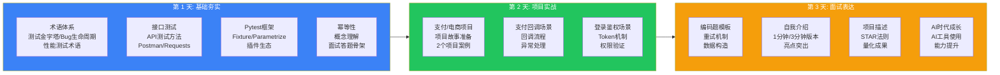

## 按天安排

```mermaid
graph LR
    subgraph Day1["第 1 天: 基础夯实"]
        A1["术语体系<br/>测试金字塔/Bug生命周期<br/>性能测试术语"]
        A2["接口测试<br/>API测试方法<br/>Postman/Requests"]
        A3["Pytest框架<br/>Fixture/Parametrize<br/>插件生态"]
        A4["幂等性<br/>概念理解<br/>面试答题骨架"]
    end

    subgraph Day2["第 2 天: 项目实战"]
        B1["支付/电商项目<br/>项目故事准备<br/>2个项目案例"]
        B2["支付回调场景<br/>回调流程<br/>异常处理"]
        B3["登录鉴权场景<br/>Token机制<br/>权限验证"]
    end

    subgraph Day3["第 3 天: 面试表达"]
        C1["编码题模板<br/>重试机制<br/>数据构造"]
        C2["自我介绍<br/>1分钟/3分钟版本<br/>亮点突出"]
        C3["项目描述<br/>STAR法则<br/>量化成果"]
        C4["AI时代成长<br/>AI工具使用<br/>能力提升"]
    end

    Day1 --> Day2
    Day2 --> Day3

    style Day1 fill:#3b82f6,color:#fff
    style Day2 fill:#22c55e,color:#fff
    style Day3 fill:#f59e0b,color:#fff
```

- 第 1 天：术语体系 + 接口测试 + Pytest + 幂等。
- 第 2 天：支付/电商项目 + 支付回调 + 登录鉴权场景题。
- 第 3 天：编码题模板 + 自我介绍 + 项目描述 + AI 时代成长表达。

## 使用建议

- 每个主题先看摘要和高频问题，再补细节。
- 把答题骨架写成自己的口语版。
- 优先准备能证明做过的 2 个项目故事。
